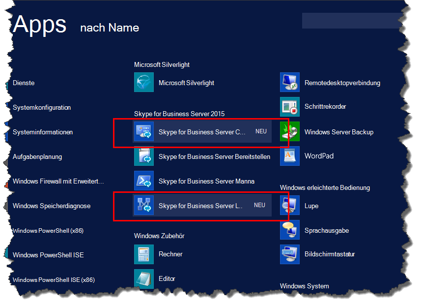

# Installieren von Verwaltungstools in Skype for Business Server
 
**Zusammenfassung:** Erfahren Sie, wie Sie die für eine Installation von Skype for Business Server erforderlichen Verwaltungstools installieren. Laden Sie eine kostenlose Testversion von Skype for Business Server aus dem Microsoft Evaluation Center herunter: [https://www.microsoft.com/evalcenter/evaluate-skype-for-business-server](https://www.microsoft.com/evalcenter/evaluate-skype-for-business-server) .
  
Zu den Verwaltungstools gehören der Topologie-Generator und die Systemsteuerung. Die Verwaltungstools müssen auf mindestens einem Server in der Topologie oder auf einer 64-Bit-Verwaltungsarbeitsstation mit einer Windows Betriebssystemversion installiert sein, die für Skype for Business Server unterstützt wird. Sie können die Schritte 1 bis 5 in beliebiger Reihenfolge ausführen. Sie müssen jedoch die Schritte 6, 7 und 8 in der reihenfolge und nach den Schritten 1 bis 5 ausführen, wie im Diagramm beschrieben. Die Installation der Verwaltungstools ist Schritt 3 von 8.
  

  
## Installieren von Skype for Business Server-Verwaltungstools

Das Installationsmedium für Skype for Business Server bietet eine flexible Oberfläche. Wenn Sie Setup.exe zum ersten Mal ausführen, werden nur der Skype for Business Server Bereitstellungs-Assistent und die Skype for Business Server-Verwaltungsshell installiert. Mithilfe dieser beiden Tools, die als Kernkomponenten bezeichnet werden, können Sie den Installationsvorgang fortsetzen, bieten jedoch keine primären Funktionen für die gesamte Skype for Business Server Umgebung. Der Bereitstellungs-Assistent wird automatisch gestartet, nachdem Sie die Hauptkomponenten installiert haben. Im Abschnitt des Bereitstellungs-Assistenten mit dem Titel **"Verwaltungstools installieren"** werden Skype for Business Server Topologie-Generator und Skype for Business Server Systemsteuerung installiert.
  
> [!IMPORTANT]
> In jeder Skype for Business Server Umgebung muss mindestens ein Server mit installierten Verwaltungstools vorhanden sein. 
  
Sehen Sie sich die Videoschritte für **die Installation von Verwaltungstools** an:
  
> [!video https://www.microsoft.com/videoplayer/embed/99a5c436-963b-4eed-b423-651568c87cb1?autoplay=false]
  
### Installieren Skype for Business Server Verwaltungstools aus dem Bereitstellungs-Assistenten

1. Fügen Sie das Skype for Business Server Installationsmedium ein. Wenn das Setup nicht automatisch beginnt, doppelklicken Sie auf **Setup**.
    
2. Die Ausführung des Installationsmediums erfordert Microsoft Visual C++. Es wird ein Dialogfeld angezeigt, in dem Sie gefragt werden, ob Sie es installieren möchten. Klicken Sie auf **Ja**.
    
3. Mithilfe von Smart Setup, einem neuen Feature in Skype for Business Server, können Sie eine Verbindung mit dem Internet herstellen, um während des Installationsvorgangs nach Updates zu suchen. Dies bietet eine bessere Benutzererfahrung, indem sichergestellt wird, dass Sie bei der Installation über die neuesten Updates für das Produkt verfügen. Klicken Sie auf **Installieren**, um mit der Installation zu beginnen.
    
4. Überprüfen Sie den Lizenzvertrag sorgfältig, und wenn Sie damit einverstanden sind, wählen Sie **"Ich stimme den Bedingungen im Lizenzvertrag zu,** und klicken Sie auf **OK."**
    
5. Die Skype for Business Server Hauptkomponenten werden auf dem Server installiert. 
    
    Die Hauptkomponenten bestehen aus folgenden Komponenten, wie in der Abbildung dargestellt.
    
    
  
   - **Skype for Business Server-Bereitstellungs-Assistent** Ein Bereitstellungsprogramm, das ein Startfeld für die Installation der verschiedenen Komponenten von Skype for Business Server bereitstellt.
    
   - **Skype for Business Server-Verwaltungsshell** Ein vorkonfiguriertes PowerShell-Programm, das die Verwaltung von Skype for Business Server ermöglicht.
    
     Sobald die Installation der Hauptkomponenten abgeschlossen ist, wird der Skype for Business Server Bereitstellungs-Assistent automatisch gestartet, wie in der Abbildung dargestellt. 
    
     
  
6. Zusätzlich zu den Hauptkomponenten müssen Sie auch Skype for Business Server Topologie-Generator und Skype for Business Server Systemsteuerung auf mindestens einem Server in der Umgebung installieren. Klicken Sie im Bereitstellungs-Assistenten auf **"Verwaltungstools installieren".**
    
7. Klicken Sie auf **Weiter**, um die Installation zu starten.
    
8. Klicken Sie nach Abschluss der Installation auf **"Fertig stellen".** Die Verwaltungstools werden nun dem Server hinzugefügt, wie in der Abbildung dargestellt.
    
    
  
   - **Skype for Business Server Topologie-Generator** Ein Programm zum Erstellen, Bereitstellen und Verwalten von Topologien.
    
   - **Skype for Business Server Systemsteuerung** Ein Programm, das zum Verwalten der Installation verwendet wird.
    

