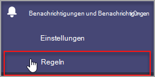

# Microsoft Teams Geräteintegritätsüberwachung

Die Geräteintegritätsüberwachung im Microsoft Teams Admin Center bietet Ihnen die Möglichkeit, die Integrität verschiedener Teams Geräte proaktiv zu überwachen. Überwachen Des Offlinestatus eines Geräts und Empfangen von Warnungen in Echtzeit, wenn das überwachte Gerät in Ihrer Organisation offline geht.  

Bevor Sie beginnen, benötigen Sie die Berechtigungen zum Erstellen von Teams/Kanälen in Ihrem Mandanten. [Weitere Informationen.](/microsoft-365/solutions/manage-creation-of-groups?view=o365-worldwide)

## Konfigurieren der Gerätestatusregel

1. Wählen Sie in der linken Navigationsleiste des Microsoft Teams Admin Centers **Benachrichtigungen &**  >  **Warnungsregeln** aus.

   

2. Wählen Sie auf der Seite **"Regeln"** die **Gerätestatusregel** aus.

3. Wählen Sie das Gerät aus, um die Statusregel zum Aktivieren von Warnungen zu konfigurieren.

    

## Interpretieren der Regelkonfiguration

|Feld |Beschreibung  |
|--------|-------------|
|**Regeltyp**   |Die Gerätestatusregel hilft Ihnen bei der effektiven Verwaltung. Teams Geräten und wird als Geräteverwaltungstyp klassifiziert. In Zukunft werden weitere Regeln des Geräteverwaltungstyps verfügbar sein, um andere verwandte Funktionen zu überwachen (Beispiele können sein: fehlerhaftes Gerät und der Anmeldestatus des Geräts).|
|**Bedingung**   |Sie können die Integrität von Geräten überwachen, wenn sie offline gehen. [Weitere Informationen](../devices/device-management.md) zur Geräteverwaltung finden Sie im Teams Admin Center. |
|**Scope**   |Sie können angeben, wie häufig der Gerätestatus überwacht werden soll, indem Sie die Regelauswertungshäufigkeit angeben. Standardmäßig werden Teams-Geräte nahezu in Echtzeit überwacht, wenn sie offline gehen. |
|**Gerätebenutzer**   |Sie können angeben, welche Geräte proaktive Offlineüberwachung benötigen, indem Sie sie basierend auf angemeldeten Benutzern auswählen. Weitere Informationen zur Konfiguration finden Sie unter ["Auswählen](#select-devices-for-configuration) von Geräten". |
|**Aktionen**  >  **Kanalwarnung**   |Im Abschnitt "Aktionen" können Sie Teams-Kanäle angeben, für die Sie Warnungen erhalten möchten. Derzeit wird ein Standardteam mit dem Namen **"Admin Alerts and Notifications" und** "Channel" mit dem Namen **"MonitoringAlerts"** erstellt, an das Benachrichtigungen übermittelt werden.     Globale Administratoren und Teams Administratoren in Ihrem Mandanten werden diesem Standardteam automatisch hinzugefügt.|
|**Aktionen**  >  **Webhook**   |Sie können auch Benachrichtigungen mit einem externen Webhook abrufen (optional). Geben Sie eine externe öffentliche Webhook-URL im Webhook-Abschnitt an, an die eine JSON-Benachrichtigungsnutzlast gesendet wird.      Die Benachrichtigungsnutzlast kann über Webhooks in andere Systeme in Ihrer Organisation integriert werden, um benutzerdefinierte Workflows zu erstellen.   

**JSON-Nutzlastschema für Webhook:**   
<pre lang="json">{      "type": "object",     "properties": {        "AlertTitle": { "type": "string "} ,       "DeviceLoggedInUserId": { "type": "string" } ,       "DeviceId": { "type": "string" } ,        "MetricValues": {              "type": "object",             "properties": {                   "DeviceHealthStatus": { "type": "string"}              }         } ,        "RuleName": { "type": "string"} ,        "RuleDescription": { "type": "string"} ,        "RuleFrequency": { "type": "string"} ,        "RuleType": { "type": "string"} ,        "TenantId": { "type": "string"} ,         "RuleCondition": { "type": "string"} ,         "AlertRaisedAt": { "type": "string"}      }  } </pre>   

  **JSON-Beispielnutzlast:**    <pre lang="JSON">    {        "AlertTitle":"*sample_device_name* of *User_Name* has become offline",       "DeviceLoggedInUserId": *User_GUID* ,       "DeviceId": *Device_GUID* ,        "MetricValues": {           DeviceHealthStatus": "offline"              },                  "RuleName": "Device state rule" ,        "RuleDescription": ":"Alerts when device health status is detected as offline" ,        "RuleFrequency": "Real-time" ,        "RuleType": "Device Management" ,        "TenantId": *Tenant_GUID* ,         "RuleCondition": "DeviceHealthStatus = Offline" ,         "AlertRaisedAt": "2020-02-28T12:49:06Z"      }  </pre>   

## Auswählen von Geräten für die Konfiguration

1. Sie können Teams Geräte auswählen, die Sie überwachen möchten, indem Sie Benutzer auswählen, die bei diesen Geräten angemeldet sind. Wählen Sie im Abschnitt **"Gerätebenutzer"** die Option **"Hinzufügen"** aus.

2. Wählen Sie einen oder mehrere Benutzer aus, für die Sie den Geräteintegritätsstatus überwachen möchten.

   

   Die ausgewählte Liste der Benutzer wird im Abschnitt **"Gerätebenutzer"** angezeigt. Sie können diese Liste ändern, indem Sie Benutzer hinzufügen oder entfernen.

Alle Anmeldegeräte, die von der ausgewählten Liste der Benutzer verwendet werden, werden auf den Offlinestatus überwacht.

## Benachrichtigungen in Teams Client

Die Benachrichtigungen werden im automatisch erstellten **MonitoringAlerts-Kanal** des **Admin-Benachrichtigungs- und Benachrichtigungsteams** übermittelt.

Eine Offlinebenachrichtigung des Geräts kann die folgenden Informationen enthalten:

- Der Offline-Gerätename.
- Der Benutzer des Offlinegeräts.
- Gibt an, zu welcher Zeit das Gerät offline geschaltet wurde. (Derzeit wird die Uhrzeit in UTC angegeben.)
- Der Typ der Regel, die die Warnung ausgelöst hat.
- Warum eine Warnung ausgelöst wird.