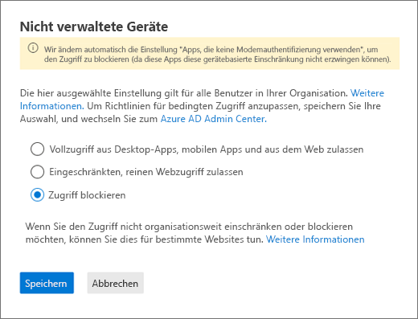

# Blockieren des Zugriffs auf SharePoint für bestimmte Benutzer

Eine Richtlinie für bedingten Zugriff (Conditional Access, AC) in SharePoint in Microsoft 365 wird auch auf Teams angewendet. Einige Organisationen möchten jedoch den Zugriff auf SharePoint-Dateien (hochladen, herunterladen, anzeigen, bearbeiten, erstellen) blockieren, ihren Mitarbeitern allerdings dennoch den Zugriff auf Desktop-, Web- und mobile Clients in Teams erlauben. Gemäß den CA-Richtlinien würde eine Blockierung von SharePoint auch zu einer Blockierung von Teams führen. In diesem Artikel wird erklärt, wie Sie diese Beschränkung umgehen können, und es Ihren Mitarbeitern ermöglichen, weiterhin Teams zu nutzen, während der Zugriff auf in SharePoint gespeicherte Dateien komplett blockiert ist.

> [!Note]
> Das Blockieren oder Einschränken des Zugriffs auf nicht verwalteten Geräte basiert auf den Azure AD-Richtlinien für bedingten Zugriff. Erfahren Sie mehr über die [Azure AD-Lizenzierung](https://azure.microsoft.com/pricing/details/active-directory/). Einen Überblick über den bedingten Zugriff in Azure AD erhalten Sie unter [Bedingter Zugriff in Azure Active Directory](https://docs.microsoft.com/azure/active-directory/conditional-access/overview). Informationen zu empfohlenen Richtlinien für den SharePoint Online-Zugriff finden Sie unter [Richtlinienempfehlungen zur Sicherung von SharePoint-Websites und -Dateien](https://docs.microsoft.com/microsoft-365/enterprise/sharepoint-file-access-policies). Wenn Sie den Zugriff auf nicht verwalteten Geräten einschränken, müssen Benutzer mit verwalteten Geräten [unterstützte Betriebssysteme oder Browser-Kombinationen](https://docs.microsoft.com/azure/active-directory/conditional-access/technical-reference#client-apps-condition) verwenden, oder ihr Zugriff wird eingeschränkt.

Sie können den Zugriff blockieren oder einschränken für:

- Benutzer in der Organisation oder nur bestimmte Benutzer oder Sicherheitsgruppen.

- Alle Websites in der Organisation oder nur bestimmte Websites.

Wenn der Zugriff blockiert wird, sehen die Benutzer eine Fehlermeldung. Das Blockieren des Zugriffs erhöht die Sicherheit und schützt sichere Daten. Wenn der Zugriff blockiert wird, sehen die Benutzer eine Fehlermeldung.

1. Öffnen Sie das SharePoint Admin Center.

2. Erweitern der **Richtlinien** > **Zugriffsrichtlinien**.

3. Wählen Sie im Abschnitt **Nicht verwaltete Geräte****Zugriff blockieren**, und wählen Sie dann **Speichern**.

   

4. Öffnen Sie das Portal [Azure Active Directory](https://portal.azure.com/#blade/Microsoft_AAD_IAM/ConditionalAccessBlade/Policies) und navigieren Sie zu **Richtlinien für den bedingten Zugriff**.

    In SharePoint wird eine neue Richtlinie erstellt, die ähnlich wie dieses Beispiel aussieht:

    

5. Aktualisieren Sie die Richtlinie, um nur bestimmte Benutzer oder eine Gruppe anzuvisieren.

    

  > [!Note]
> Wenn Sie diese Richtlinie festlegen, wird Ihr Zugriff auf das SharePoint-Administratorportal eingeschränkt. Wir empfehlen, dass Sie diese Ausschlussrichtlinie konfigurieren, und dann die globalen Administratoren und SharePoint-Administratoren auswählen.

6. Stellen Sie sicher, dass nur SharePoint als gezielte Cloud-App ausgewählt ist

    

7. Aktualisieren Sie die **Bedingungen**, um auch Desktop-Clients einzuschließen.

    

8. Stellen Sie sicher, dass **Zugriff gewähren** aktiviert ist

    

9. Stellen Sie sicher, dass **Von der App erzwungene Einschränkungen** aktiviert ist.

10. Aktivieren Sie Ihre Richtlinie und wählen Sie **Speichern**.

    

Um Ihre Richtlinie zu testen, müssen Sie sich von allen Clients wie der Teams-Desktop-App oder OneDrive for Business-Synchronisierungsclient abmelden und wieder anmelden, um zu sehen, ob die Richtlinie funktioniert. Wenn Ihr Zugriff blockiert wurde, sehen Sie eine Nachricht in Teams, die angibt, dass das Element unter Umständen nicht existiert.

 

In SharePoint erhalten Sie die Fehlermeldung, dass der Zugriff verweigert wurde.

## Verwandte Themen

[Steuern des Zugriffs auf nicht verwaltete Geräten in SharePoint](https://docs.microsoft.com/sharepoint/control-access-from-unmanaged-devices)
