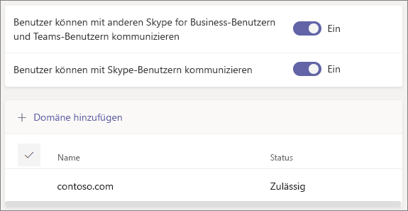

# Verwenden Sie den Gastzugriff und den externen Zugriff, um mit Personen außerhalb Ihres Unternehmens zusammenzuarbeiten

In diesem Artikel werden zwei Optionen für die Zusammenarbeit mit Personen außerhalb Ihrer Organisation beschrieben:

- **Externer Zugriff** – Ein Typ des Partnerverbunds, der es Benutzern erlaubt, Personen in anderen Organisationen zu finden, sie anzurufen und mit ihnen zu chatten. Diese Personen können nicht zu einem Team hinzugefügt werden, außer wenn sie als Gäste eingeladen werden.
- **Gastzugriff** – Mit dem Gastzugriff können Sie Personen von außerhalb Ihrer Organisation einladen, einem Team beizutreten. Eingeladene Personen erhalten ein Gastkonto im Azure Active Directory.

Eine vollständige Übersicht über die externe Zusammenarbeit in Microsoft 365 finden Sie unter [Übersicht über Optionen für die externe Zusammenarbeit in Microsoft 365](/microsoft-365/enterprise/external-guest-access).

## Externer Zugriff (externer Chat und Besprechungen)

Richten Sie externen Zugriff ein, wenn Sie Personen außerhalb Ihrer Organisation, die Teams, Skype for Business (online oder lokal) oder Skype verwenden, suchen, sie anrufen, mit ihnen chatten und Besprechungen mit ihnen einrichten müssen. 

Der externe Zugriff ist standardmäßig für alle Domänen aktiviert. Sie können den externen Zugriff einschränken, indem Sie bestimmte Domänen zulassen oder blockieren oder den Zugriff deaktivieren.

Externer Zugriff ist für die folgenden Mandanten verfügbar:

- Übergreifend und zwischen Commercial, GCC und GCC High
- Nur zwischen DOD

Weitere Informationen zum Konfigurieren des externen Zugriffs finden Sie unter [Externen Zugriff verwalten](manage-external-access.md). 

>[!NOTE]
> Die Lizenzen von [Microsoft Teams kostenlos (klassisch)](https://support.microsoft.com/office/welcome-to-microsoft-teams-free-classic-6d79a648-6913-4696-9237-ed13de64ae3c) unterstützen keinen externen Zugriff.

## Gastzugriff

Verwenden Sie den Gastzugriff, um Personen von außerhalb Ihrer Organisation zu einem Team hinzuzufügen, in dem sie chatten, anrufen, treffen und an Dateien zusammenarbeiten können. Einem Gast können fast alle Funktionen des Teams gleich wie einem nativen Teammitglied zur Verfügung gestellt werden. Weitere Informationen finden Sie unter [Gasterfahrung in Teams](guest-experience.md).

Gäste werden dem Azure Active Directory Ihrer Organisation als B2B-Benutzer hinzugefügt und müssen sich mit ihrem Gastkonto in Teams anmelden. Dies bedeutet, dass sie sich möglicherweise in seiner eigenen Organisation abmelden müssen, um sich bei Ihrer Organisation anzumelden.

Der Gastzugriff ist für die folgenden Mandanten verfügbar:

- Übergreifend und zwischen Commercial und GCC
- Nur zwischen GCC High
- Nur zwischen DOD

Informationen zum Konfigurieren des Gastzugriffs für Teams finden Sie unter [Zusammenarbeit mit Gästen in einem Team](/microsoft-365/solutions/collaborate-as-team).

## Vergleich zwischen externem Zugriff und Gastzugriff

Die folgende Tabelle zeigt die Unterschiede zwischen dem externen Zugriff (Partnerverbund) und Gästen. In beiden Fällen werden Personen von außerhalb Ihrer Organisation gegenüber Ihren Benutzern als „extern“ bezeichnet.

### Dinge, die Ihre Benutzer tun können

| Benutzer können | Benutzer mit externem Zugriff | Gäste |
|---------|-----------------------|--------------------|
| Mit jemandem in einer anderen Organisation chatten | Ja | Ja |
| Jemanden in einer anderen Organisation anrufen | Ja | Ja |
| Sehen, ob jemand aus einer anderen Organisation für Anrufe oder Chats verfügbar ist | Ja | Ja1 |
| Nach Personen in anderen Organisationen suchen | Ja2 | Nein |
| Freigeben von Dateien | Nein | Ja |
| Die Abwesenheitsnachricht eines Mitarbeiters einer anderen Organisation anzeigen | Nein | Ja |
| Jemanden in einer anderen Organisation sperren  | Nein | Ja |
| Verwenden von @Erwähnungen | Ja3 | Ja |

### Dinge, die Personen von außerhalb der Organisation tun können

| Personen von außerhalb Ihrer Organisation können | Benutzer mit externem Zugriff | Gäste |
|---------|-----------------------|--------------------|
| Auf Teams-Ressourcen zugreifen | Nein | Ja |
| Zu einem Gruppenchat hinzugefügt werden | Ja | Ja |
| Zu einer Besprechung eingeladen werden | Ja | Ja |
| Private Anrufe führen | Ja | Ja5 |
| Telefonnummer für Teilnehmer von Einwahlbesprechungen anzeigen | Nein4 | Ja |
| IP-Video verwenden | Ja | Ja5 |
| Bildschirmfreigabe verwenden | Ja3 | Ja5 |
| „Jetzt besprechen“ verwenden | Nein | Ja5 |
| Gesendete Nachrichten bearbeiten | Ja3 | Ja5 |
| Gesendete Nachrichten löschen | Ja3 | Ja5 |
| Giphy in einer Unterhaltung verwenden | Ja3 | Ja5 |
| Memes in einer Unterhaltung verwenden | Ja3 | Ja5 |
| Sticker in einer Unterhaltung verwenden | Ja3 | Ja5 |
| Anwesenheit wird angezeigt | Ja | Ja |
| Verwenden von @Erwähnungen | Ja3 | Ja |

 

1 Vorausgesetzt, der Benutzer wurde als Gast hinzugefügt und hat sich mit dem Gastkonto angemeldet. 
2 Nur per E-Mail- oder SIP-Adresse (Session Initiation Protocol). 
3 Unterstützt für 1:1-Chat nur für Teams zu Teams-Benutzer aus zwei verschiedenen Organisation.  
4 Standardmäßig können externe Teilnehmer die Telefonnummern der eingewählten Teilnehmer nicht sehen. Wenn Sie die Vertraulichkeit dieser Telefonnummern wahren wollen, wählen Sie **Töne** für **Typ der Ankündigungen von Ein-/Ausgängen** aus (dies verhindert, dass die Nummern von Teams ausgelesen werden). Weitere Informationen finden Sie unter Aktivieren oder [Deaktivieren von Ankündigungen bei Zu- oder Abgang für Besprechungen in Microsoft Teams](turn-on-or-off-entry-and-exit-announcements-for-meetings-in-teams.md). 
5 Standardmäßig zugelassen, kann aber vom Teams-Administrator deaktiviert werden

## Verwandte Themen

[Externer Zugriff in Teams](manage-external-access.md)

[Gastzugriff in Teams](guest-access.md)
