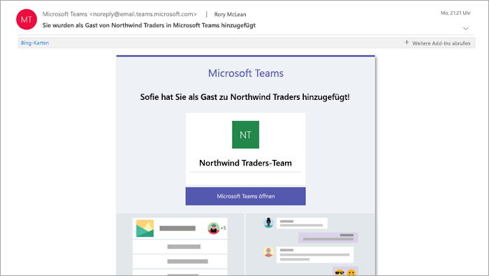

# Gast Erfahrung in Teams

Wenn ein Gast zu einem Team eingeladen wird, erhält er eine Willkommens-E-Mail-Nachricht. Diese Nachricht enthält einige Informationen zum Team und was ihn jetzt als Mitglied erwartet. Der Gast muss die Einladung in der E-Mail-Nachricht durch das Klicken auf **Microsoft Teams öffnen** annehmen, bevor er auf das Team und dessen Kanäle zugreifen kann.

> [!NOTE]
> Nachdem ein Gast einem Team hinzugefügt wurde, kann es einige Stunden dauern, bis er Zugriff hat.
    

    
Alle Teammitglieder sehen eine Nachricht in einem Kanal-Thread. Darin werden die Mitglieder darüber informiert, dass der Teambesitzer einen Gast hinzugefügt hat, und der Name des Gasts wird angezeigt. Jeder im Team kann also sofort sehen, bei welchem Mitglied es sich um einen Gast handelt. Ein Tag in der oberen rechten Ecke des Kanal-Threads zeigt die Anzahl der Gäste im Team an und neben dem Namen jedes Gasts wird eine **(Gast)** -Beschriftung angezeigt.

Schauen Sie sich diese Videos zu den Gast Erfahrungen in Teams an:
- [Teilnehmen an einer Teams-Besprechung als Gast](https://support.microsoft.com/office/join-a-teams-meeting-078e9868-f1aa-4414-8bb9-ee88e9236ee4)
- [Zusammenarbeiten mit externen Gästen in einer Teams-Besprechung](https://support.microsoft.com/office/work-with-external-guests-180ed260-d3ef-4247-9f24-1984fc76d5f0)

## Vergleich der Funktionen für Team-Mitglieder und -Gäste

In der folgenden Tabelle werden die Microsoft Teams-Funktionen verglichen, die jeweils für die Mitglieder und die Gäste eines Teams einer Organisation verfügbar sind. Teams-Administratoren steuern die Features, die den Gästen zu Verfügung stehen.

| Funktionen in Teams | Teams-Benutzer in der Organisation | Gast |
|:-----|:-----|:-----|
|Erstellen eines Kanals     *Teambesitzer steuern diese Einstellung.*    |&#x2713;|&#x2713;|
|Teilnehmen an einem privaten Chat    |&#x2713;|&#x2713;|
|Teilnehmen an einer Kanalunterhaltung    |&#x2713;|&#x2713;|
|Posten, Löschen und Bearbeiten von Nachrichten    |&#x2713;|&#x2713;|
|Freigeben einer Kanal-Datei    |&#x2713;|&#x2713;|
|Zugreifen auf SharePoint-Dateien  |&#x2713;|&#x2713;|
|Anfügen von Dateien  |&#x2713;|Nur Kanalbeiträge|
|Herunterladen privater Chat-Dateien  |&#x2713;|&#x2713;|
|Suchen in Dateien  |&#x2713;||
|Freigeben einer Chatdatei    |&#x2713;||
|Hinzufügen von Apps (Registerkarten, Bots oder Connectors)    |&#x2713;||
|Erstellen von Besprechungen oder Zugreifen auf Zeitpläne    |&#x2713;||
|Zugreifen auf OneDrive for Business-Speicher    |&#x2713;||
|Erstellen von mandantenweiten Richtlinien und solchen für den Gastzugriff in Teams/Kanälen    |&#x2713;||
|Einladen eines Benutzers außerhalb der Domäne der Microsoft 365- oder Office 365-Organisation    *Teambesitzer steuern diese Einstellung.*      |&#x2713;||
|Erstellen eines Teams    |&#x2713;||
|Ein öffentliches Team suchen und daran teilnehmen    |&#x2713;||
|Einsicht nehmen in das Organigramm    |&#x2713;||
|Verwenden der Inline-Übersetzung    |&#x2713;||
|Teambesitzer werden    |&#x2713;||

In der folgenden Tabelle werden die für Gäste verfügbaren Anruf- und Besprechungsfeatures mit jenen für andere Benutzertypen verglichen.

| Anruffunktion | Gast | E1- und E3-Benutzer | E5- und Enterprise-VoIP-Benutzer |
| --------------- | ----- | -------------- | -------------- |
| VoIP-Anruf | Ja | Ja | Ja |
| Gruppenanrufe | Ja | Ja | Ja |
| Unterstützte zentrale Anruf-Steuerelemente (anhalten, Stummschaltung, Video ein/aus, Bildschirmfreigabe) | Ja | Ja | Ja |
| Durchstellungsziel | Ja | Ja | Ja |
| Können Anruf weiterleiten | Ja | Ja | Ja |
| Zu Gesprächsübergabe mit Ankündigung ermächtigt | Ja | Ja | Ja |
| Können weitere Benutzer zu einem Anruf über VoIP hinzufügen | Ja | Ja | Ja |
| Können Benutzer per Telefonnummer zu einem Anruf hinzufügen | Nein | Nein | Ja |
| Weiterleitungsziel | Nein | Ja | Ja |
| Anrufgruppenziel | Nein | Ja | Ja |
| Ziel für nicht beantwortet | Nein | Ja | Ja |
| Können Ziel für einen Verbundanruf sein | Nein | Ja | Ja |
| Können einen Verbundanruf tätigen | Nein | Ja | Ja |
| Können ihre Anrufe sofort weiterleiten | Nein | Nein | Ja |
| Können gleichzeitig Anrufe tätigen | Nein | Nein | Ja |
| Können ihre unbeantworteten Anrufe weiterleiten | Nein | Nein | Ja |
| Verpasste Anrufe können an Voicemail weitergeleitet werden | Nein | Nein1 |Ja |
| Verfügt über eine Telefonnummer, mit der Anrufe empfangen werden können | Nein | Nein | Ja |
| Kann Telefonnummern anrufen | Nein | Nein | Ja |
| Hat Zugriff auf Anrufeinstellungen | Nein | Nein | Ja |
| Kann Voicemail-Begrüßung ändern | Nein | Nein1 | Ja |
| Kann Klingeltöne ändern | Nein | Nein  | Ja |
| Unterstützt TTY | Nein | Nein | Ja |
| Können Stellvertretungen haben | Nein | Nein | Ja |
|  Können als Stellvertretung fungieren | Nein | Nein | Ja |

1 Dieses Feature wird in Kürze verfügbar sein.

> [!NOTE]
> Die Richtlinie **Zugriffseinschränkungen für Gastbenutzer** in Azure Active Directory (Azure AD) bestimmt die Berechtigungen für Gäste in Ihrem Verzeichnis. Es gibt drei Richtlinienoptionen.
>  - Die Einstellung **Gastbenutzer haben denselben Zugriff wie Mitglieder (am umfassendsten)** bedeutet, dass Gäste denselben Zugriff auf Verzeichnisdaten haben wie normale Benutzer in Ihrem Verzeichnis.
>  - Die Einstellung **Gastbenutzer haben eingeschränkten Zugriff auf Eigenschaften und die Mitgliedschaft bei Verzeichnisobjekten** bedeutet, dass Gäste keine Berechtigungen für bestimmte Verzeichnisaufgaben haben, z. B. das Auflisten von Benutzern, Gruppen oder anderen Verzeichnisressourcen mithilfe von Microsoft Graph.
>  - Die Einstellung **Gastbenutzerzugriff ist eingeschränkt auf Eigenschaften und Mitgliedschaften bei ihren eigenen Verzeichnisobjekten (am restriktivsten)** bedeutet, dass Gäste nur auf Ihre eigenen Verzeichnisobjekte zugreifen können.
>
>Weitere Informationen hierzu finden Sie unter [Was sind die Standardbenutzerberechtigungen in Azure Active Directory?](/azure/active-directory/fundamentals/users-default-permissions)

## Verwandte Themen

[Beenden einer Organisation als Gast](/azure/active-directory/b2b/leave-the-organization)

[Verwenden Sie den Gastzugriff und den externen Zugriff, um mit Personen außerhalb Ihres Unternehmens zusammenzuarbeiten](communicate-with-users-from-other-organizations.md)
