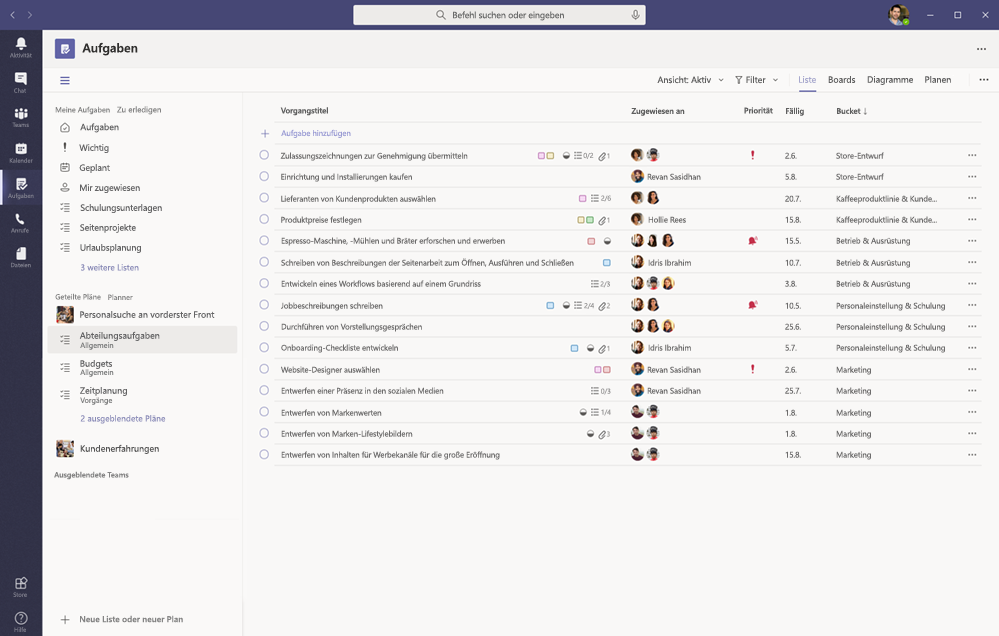
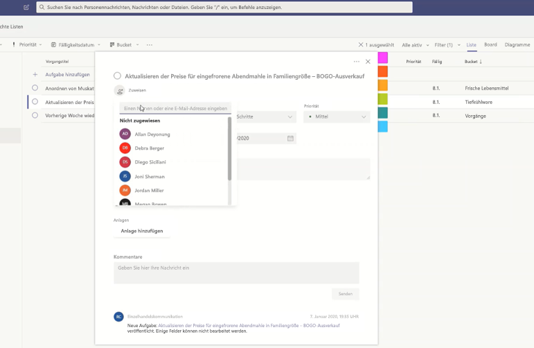
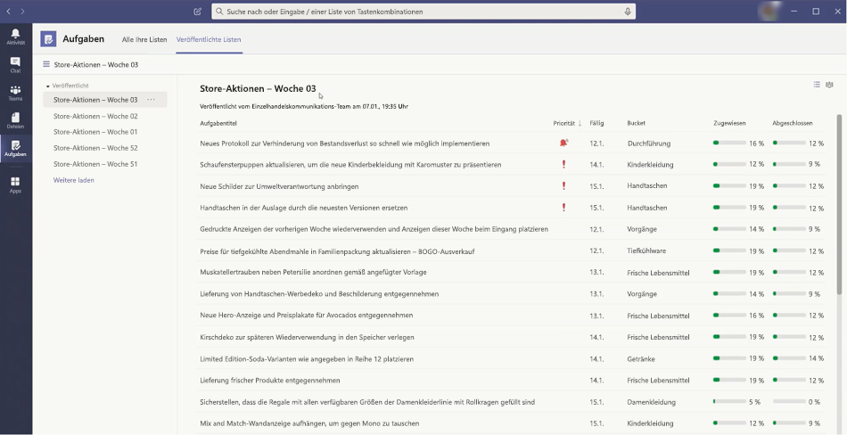

# Verwalten der Tasks-App für Ihre Organisation in Microsoft Teams

## Übersicht über Tasks

Die Tasks-App vereint die Aufgabenverwaltung in Microsoft Teams und vereint an einem Ort einzelne Aufgaben, die von [Microsoft To Do](https://todo.microsoft.com/tasks/) unterstützt werden, sowie Teamaufgaben, die von Planner unterstützt werden. Benutzer können auf Tasks als App auf der linken Seite von Teams und als Registerkarte in einem Kanal innerhalb einzelner Teams zugreifen. **Meine Aufgaben** und **Freigegebene Pläne** in Tasks ermöglichen es Benutzern, alle ihre individuellen und Teamaufgaben anzuzeigen und zu verwalten und ihre Arbeit zu priorisieren. Tasks stehen in Teams Desktop-, Web- und mobilen Clients zur Verfügung. 

> [!NOTE]
> Während wir die Tasks-Erfahrung in Teams-Desktopclients entwickeln, wird Benutzern der App-Name zunächst als **Planner** angezeigt. Der Name wird dann vorübergehend in **Tasks von Planner und To Do** geändert und wird dann später in **Tasks** umbenannt. Bei mobilen Teams-Clients wird den Benutzern der App-Name immer als **Tasks** angezeigt. Es kann eine kurze Verzögerung bei der Verfügbarkeit der mobilen Benutzererfahrung geben, nachdem die Desktoperfahrung verfügbar ist.

   

Für Organisationen, die das Aufgabenmanagement für Mitarbeiter in Service und Produktion optimieren möchten, umfasst Tasks auch Funktionen, die es Ihnen ermöglichen, Aufgaben aller Ihrer Mitarbeiter in Service und Produktion anzuvisieren, zu veröffentlichen und zu verfolgen. So können die Unternehmens- und Regionalleitung beispielsweise Aufgabenlisten erstellen und veröffentlichen, die auf relevante Orte ausgerichtet sind – z. B. bestimmte Einzelhandelsgeschäfte – und den Fortschritt in Echtzeitberichten nachverfolgen. Vorgesetzte können ihren Mitarbeitern Aufgaben und direkte Aktivitäten innerhalb ihrer Standorte zuweisen, und Mitarbeiter in Service und Entwicklung haben eine priorisierte Liste Ihrer zugewiesenen Aufgaben auf einem mobilen Gerät oder Desktop. Um [Aufgabenveröffentlichung](#task-publishing) zu aktivieren, müssen Sie zuerst eine Team-Adressierungshierarchie für Ihre Organisation einrichten, in der definiert wird, wie alle Teams in der Hierarchie miteinander verknüpft sind.

## Wissenswertes über Tasks

Tasks ist als App und als Registerkarte in einem Kanal verfügbar. Denken Sie daran, dass die App sowohl einzelne Aufgaben aus To Do als auch Teamaufgaben aus Planner umfasst, während auf der Registerkarte nur Teamaufgaben angezeigt werden.

Mit Tasks erhalten die Benutzer eine Desktop-, Web- und mobile Erfahrung. Wenn Tasks auf dem Teams-Desktopclient installiert ist, wird es den Benutzern auch in ihren Web- und mobilen Clients von Teams angezeigt. Die Ausnahme sind Gastbenutzer. Es ist wichtig zu wissen, dass Gäste nur über den mobilen Teams-Client als App auf Aufgaben zugreifen können. Gästen werden die Tasks-Registerkarten sowohl auf dem Teams-Desktop als auch auf Webclients angezeigt.

**Meine Aufgaben** zeigt die individuellen Aufgaben eines Benutzers an. **Freigegebene Pläne** zeigen Aufgaben an, an denen das gesamte Team arbeitet, und enthält alle Aufgabenlisten, die einem Kanal als Tasks-Registerkarte hinzugefügt wurden. Beachten Sie Folgendes:

- Aufgabenlisten, die ein Benutzer in der Tasks-App erstellt, werden auch in den Aufgabenclients für diesen Benutzer angezeigt. Ähnlich dazu werden Aufgabenlisten, die ein Benutzer in der To Do-App erstellt, auch in **Meine Aufgaben** in Tasks für diesen Benutzer angezeigt. Das Gleiche gilt für individuelle Aufgaben.

- Alle Tasks-Registerkarten, die einem Kanal hinzugefügt wurden, werden auch in Planner-Clients angezeigt. Wenn ein Benutzer einen Plan in Planner erstellt, wird der Plan nur dann in der Tasks- oder Planner-App angezeigt, wenn er einem Kanal als Registerkarte hinzugefügt wurde. Wenn ein Benutzer eine neue Tasks-Registerkarte hinzufügt, kann er eine neue Liste oder einen neuen Plan erstellen oder eine vorhandene auswählen.

## Tasks einrichten

> [!IMPORTANT]
> Einstellungen und Richtlinien, die Sie für Planner konfiguriert haben, gelten auch für Tasks.

### Tasks in Ihrer Organisation aktivieren oder deaktivieren

Tasks ist standardmäßig für alle Microsoft Teams-Benutzer in Ihrer Organisation aktiviert. Sie können die App auf Organisationsebene im Microsoft Teams Admin Center auf der Seite [Apps verwalten](manage-apps.md) deaktivieren oder aktivieren.

1. Wechseln Sie in der linken Navigationsleiste des Microsoft Teams Admin Centers zu **Teams-Apps** > **Apps verwalten**.
2. Führen Sie in der Liste der Apps einen der folgenden Schritte aus:

    - Wenn Sie Tasks für Ihre Organisation deaktivieren möchten, suchen Sie nach der Tasks-App, wählen Sie sie aus, und klicken Sie dann auf **Blockieren**.
    - Wenn Sie Tasks für Ihre Organisation aktivieren möchten, suchen Sie nach der Tasks-App, wählen Sie sie aus, und klicken Sie dann auf **Zulassen**.

> [!NOTE]
> Wenn Sie die Tasks-App nicht finden können, suchen Sie nach den Namen im ersten Hinweis dieses Artikels. Die App könnte noch im Prozess der Umbenennung sein.

### Aktivieren oder Deaktivieren von Tasks für bestimmte Benutzer in Ihrer Organisation

Wenn Sie die Nutzung von Tasks für bestimmte Benutzer in Ihrer Organisation zulassen oder blockieren möchten, stellen Sie sicher, dass Tasks für Ihre Organisation auf der Seite [Apps verwalten](manage-apps.md) aktiviert ist, und erstellen Sie dann eine benutzerdefinierte App-Berechtigungsrichtlinie, und weisen Sie diese den betreffenden Benutzern zu. Weitere Informationen finden Sie unter [Verwalten von Richtlinien für App-Berechtigungen in Microsoft Teams](teams-app-permission-policies.md).

### Verwenden einer App-Setuprichtlinie, um Tasks an Teams anzuheften

Mithilfe von App-Setup Richtlinien können Sie Microsoft Teams so anpassen, dass die Apps, die für die Benutzer in Ihrer Organisation am wichtigsten sind, hervorgehoben werden. Die von Ihnen in einer Richtlinie festgelegten Apps werden an die App-Leiste angeheftet&mdash;die Leiste auf der Seite des Teams-Desktop-Clients und am unteren Rand des Teams Mobile-Clients&mdash;von wo die Benutzer schnell und einfach darauf zugreifen können.

Wenn Sie die Tasks-App für Ihre Benutzer anheften möchten, können Sie die globale Richtlinie (organisationsweite Standardrichtlinie) bearbeiten oder eine benutzerdefinierte App-Setuprichtlinie erstellen und zuweisen. Weitere Informationen finden Sie unter [Verwalten von App-Einrichtungsrichtlinien in Microsoft Teams](teams-app-setup-policies.md).

### "Meine Aufgaben" eines Benutzers sind sichtbar, wenn der Benutzer für Exchange Online lizenziert ist.

Wenn ein Benutzer **Meine Aufgaben** nicht sehen soll, können Sie es ausblenden. Dazu [entfernen Sie die Exchange Online-Lizenz des Benutzers](/microsoft-365/admin/manage/remove-licenses-from-users). Es ist wichtig zu wissen, dass der Benutzer nach dem Entfernen einer Exchange Online-Lizenz keinen Zugriff mehr auf sein Postfach hat.  Postfachdaten werden 30 Tage lang gespeichert. Danach werden die Daten entfernt und können nicht wiederhergestellt werden, es sei denn, das Postfach wird in [In-Situ-Aufbewahrung oder Aufbewahrung für juristische Zwecke](/exchange/security-and-compliance/in-place-and-litigation-holds) gestellt.

Wir empfehlen dies nicht für Information-Worker, aber es kann einige Szenarien geben, in denen dies gelten kann, z. B. für Mitarbeiter in Service und Produktion, die nicht auf E-Mails angewiesen sind.

## Aufgabenveröffentlichung

Mit der Aufgabenveröffentlichung kann Ihre Organisation Aufgabenlisten veröffentlichen, die auf bestimmte Orte (Teams) in der gesamten Organisation ausgerichtet sind, um einen Arbeitsplan zu definieren und zu teilen, der an diesen Orten erledigt werden soll.

- Personen im Veröffentlichungsteam, z. B. die Unternehmens- und Regionalleitung, können Aufgabenlisten erstellen und diese in bestimmten Teams veröffentlichen. 
    
- Manager in den Empfängerteams können die veröffentlichten Aufgabenlisten überprüfen und Teammitgliedern einzelne Aufgaben zuweisen. 
    
- Mitarbeiter in Service und Produktion verfügen über eine einfache mobile Erfahrung, um die ihnen zugewiesenen Aufgaben zu sehen. Sie können Fotos anfügen, um gegebenenfalls ihre Arbeit zu zeigen und ihre Aufgaben als erledigt kennzeichnen.
- Herausgeber und Manager können Berichte anzeigen, um die Zuordnung und den Erledigungsstatus von Aufgaben auf jeder Ebene zu sehen, einschließlich sortiert nach Standort (Team), Aufgabenliste und individueller Aufgabe. 
    

Benutzer erstellen, verwalten und veröffentlichen Aufgabenlisten auf der Registerkarte **Veröffentlichte Listen** in der Tasks-App. Diese Registerkarte wird einem Benutzer nur angezeigt, wenn Ihre Organisation [eine Team-Adressierungshierarchie eingerichtet](#set-up-your-team-targeting-hierarchy) hat und sich der Benutzer in einem Team befindet, das in der Hierarchie enthalten ist. Die Hierarchie bestimmt, ob der Benutzer Aufgabenlisten veröffentlichen oder empfangen und Berichte für empfangene Listen anzeigen kann.

### Beispielszenario

Hier ist ein Beispiel für die Funktionsweise der Aufgabenveröffentlichung.

Contoso entwickelt eine Aktion zum Mitnehmen und Liefern von Lebensmitteln. Um eine konsistente Markenerfahrung zu gewährleisten, müssen sie die konsistente Umsetzung des Rollouts in über 300 Store-Standorten koordinieren.

Das Marketingteam teilt die Aktionsdetails und die entsprechende Aufgabenliste mit der Retail Communications Managerin. Die Retail Communications Managerin, die als „Gatekeeper“ für die Läden fungiert, überprüft die Informationen, erstellt eine Aufgabenliste für die Werbeaktion und erstellt dann eine Aufgabe für jede Arbeitseinheit, die von jedem der betroffenen Läden ausgeführt werden muss. Nach Abschluss der Aufgabenliste muss sie die Filialen auswählen, die die Arbeit erledigen müssen. In diesem Fall gilt die Werbeaktion nur für Läden in den Vereinigten Staaten, in denen es ein In-Store-Restaurant gibt. In Tasks filtert sie die Ladenliste basierend auf dem Attribut „In-Store Restaurant“, wählt die entsprechenden US-Standorte in der Hierarchie aus und veröffentlicht die Aufgabenliste dann in diesen Läden.

Die Ladenmanager an den einzelnen Standorten erhalten eine Kopie der veröffentlichten Aufgaben und weisen diese Aufgaben den Teammitgliedern zu. Manager können die Tasks-Erfahrung verwenden, um zu erkennen, welche Arbeiten in ihrem Laden erforderlich sind. Sie können auch die verfügbaren Filter verwenden, um sich auf eine bestimmte Gruppe von Arbeit (z. B. heute fällige Arbeit oder Arbeit in einem bestimmten Bereich) zu konzentrieren.

Mitarbeiter in Service und Produktion haben jetzt an jedem Ladenstandort eine priorisierte Liste ihrer Arbeit in Tasks auf ihrem Mobilgerät. Wenn sie eine Aufgabe erledigt haben, markieren sie sie als abgeschlossen. Einige entscheiden sich vielleicht sogar dafür, ein Foto hochzuladen und an die Aufgabe anzufügen, um ihre Arbeit zu zeigen.

Die Contoso-Zentrale und Zwischenmanager können Berichte anzeigen, um die Zuordnung und den Erledigungsstatus von Aufgaben in jedem Laden und in allen Filialen anzuzeigen. Sie können auch eine bestimmte Aufgabe aufschlüsseln, um den Status in verschiedenen Läden anzuzeigen. Wenn sich der Starttermin nähert, können Sie abnorme Abweichungen erkennen und gegebenenfalls mit ihren Teams Rücksprache halten. Diese Sichtbarkeit ermöglicht es Contoso, die Effizienz des Rollouts zu verbessern und eine konsistentere Erfahrung in allen Filialen zu bieten.

### Einrichten Ihrer Team-Adressierungshierarchie

Um die Aufgabenveröffentlichung in Ihrer Organisation zu aktivieren, müssen Sie zuerst das Schema für die Teamadressierung in einer CSV-Datei einrichten. Das Schema definiert, wie alle Teams in Ihrer Hierarchie miteinander in Verbindung stehen und welche Attribute zum Filtern und Auswählen von Teams verwendet werden. Nachdem Sie das Schema erstellt haben, laden Sie es in Teams hoch, um es auf Ihre Organisation anzuwenden. Mitglieder des Veröffentlichungsteams, so wie im Beispielszenario die Retail Communications Managerin, können die Teams dann nach Hierarchie, Attributen oder einer Kombination aus beidem filtern, um die relevanten Teams auszuwählen, die die Aufgabenlisten erhalten sollen, und dann die Aufgabenlisten für diese Teams veröffentlichen.

Schritte zum Einrichten der Hierarchie Team-Adressierungshierarchie finden Sie unter [Einrichten Ihrer Team-Adressierungshierarchie](set-up-your-team-hierarchy.md).

## Power Automate und Graph-API

Tasks unterstützt Power Automate für To Do und Graph-APIs für Planner. Weitere Informationen finden Sie unter:

- [Übersicht über Planner-Aufgaben und Pläne-API](/graph/planner-concept-overview)
- [Verwenden von Microsoft To Do mit Power Automate](https://support.office.com/article/using-microsoft-to-do-with-power-automate-526e8f75-217b-46e0-9e06-44780b72c295)