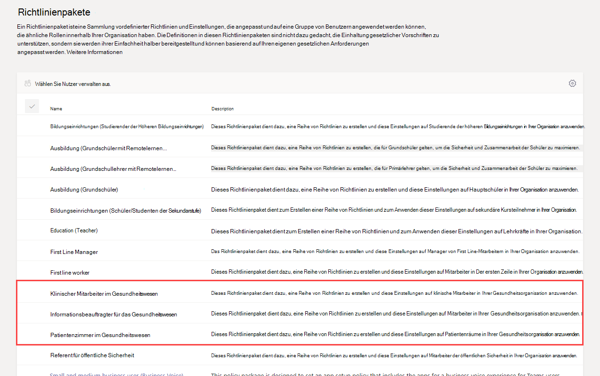
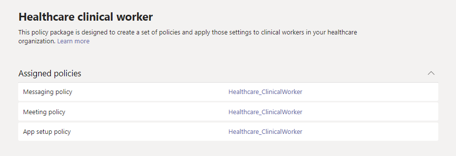

# Teams Richtlinienpakete-Pakete für das Gesundheitswesen

## Übersicht

Ein [Richtlinienpaket](manage-policy-packages.md) in Microsoft Teams ist eine Sammlung vordefinierter Richtlinien und Richtlinieneinstellungen, die Sie Benutzern zuweisen können, die ähnliche Rollen in Ihrer Organisation haben. Richtlinienpakete vereinfachen, rationalisieren und sorgen für Konsistenz bei der Verwaltung von Richtlinien. Sie können die Einstellungen der Richtlinien im Paket an die Anforderungen Ihrer Benutzer anpassen. Wenn Sie die Einstellungen von Richtlinien in einem Richtlinienpaket ändern, erhalten alle Benutzer, die diesem Paket zugewiesen sind, die aktualisierten Einstellungen. Sie können Richtlinienpakete mithilfe des Microsoft Teams Admin Centers oder von PowerShell verwalten.

> [!VIDEO https://www.microsoft.com/videoplayer/embed/RE4Ht2o]

Richtlinienpakete definieren je nach Paket Richtlinien für Folgendes vor:

- Messaging
- Besprechungen
- Anrufe
- App-Setup
- Liveereignisse

Die Teams umfassen derzeit die folgenden Gesundheitsrichtlinien-Pakete.

|Paketname im Microsoft Teams Admin Center|Am besten geeignet für|Beschreibung |
|---------|---------|---------|
|Klinischer Mitarbeiter im Gesundheitswesen  |Klinische Mitarbeiter in Ihrer Gesundheitsorganisation  |Erstellt eine Reihe von Richtlinien und Richtlinieneinstellungen, mit denen klinische Mitarbeiter wie Krankenschwestern, Krankenschwestern, Ärzte und Sozialarbeiter uneingeschränkten Zugriff auf Chat, Anrufe, Schichtmanagement und Besprechungen erhalten. |
|Informationsbeauftragter für das Gesundheitswesen  |Informationsbeauftragter in Ihrer Gesundheitsorganisation |Erstellt eine Reihe von Richtlinien und Richtlinieneinstellungen, mit denen Informationsbeauftragte wie IT-Personal, Informatikpersonal, Finanzpersonal und Compliance-Beauftragte uneingeschränkten Zugriff auf Chat, Anrufe und Besprechungen erhalten.|
|Patientenzimmer im Gesundheitswesen  |Geräte des Patientenzimmers|Erstellt eine Reihe von Richtlinien und Richtlinieneinstellungen, die für Patientenzimmer in Ihrer Gesundheitsorganisation gelten.|

Jede einzelne Richtlinie erhält den Namen des Richtlinienpakets, sodass Sie die Richtlinien, die mit einem Richtlinienpaket verknüpft sind, leicht identifizieren können. Wenn Sie beispielsweise Klinikern in Ihrer Organisation das Richtlinienpaket für klinische Mitarbeiter im Gesundheitswesen zuweisen, wird für jede Richtlinie im Paket eine Richtlinie mit dem Namen Healthcare_ClinicalWorker erstellt.

## Beginnen Sie mit Richtlinienpaketen

Um mit den Richtlinienpaketen für das Gesundheitswesen zu beginnen, wählen Sie im Onboarding-Hub des Microsoft Admin Center die Option **Gesundheitswesen** und anschließend **Richtlinieneinstellungen nach Rolle zuweisen**. Wenn Sie bereit sind, entscheiden Sie, welchen Richtlinienpaketen Sie Personen in Ihrer Organisation zuweisen möchten.

Wählen Sie **Richtliniendetails anzeigen**, um mehr über die spezifischen Richtlinien in einem Paket und ihre jeweiligen Einstellungen zu erfahren. Diese können nach der Zuweisung im Teams Admin Center [angepasst werden](manage-policy-packages.md#customize-policies-in-a-policy-package).

Wählen Sie ein oder mehrere Pakete zum Zuweisen aus und klicken Sie dann auf **Weiter**. Sie können nach Personen suchen und sie dem Richtlinienpaket hinzufügen, das für ihre Rolle am besten geeignet ist. Eine Person kann nicht mehr als einem Richtlinienpaket gleichzeitig zugewiesen werden.

Sobald Sie dem richtigen Richtlinienpaket Personen hinzugefügt haben, schließt **Beenden** Ihre Auswahl ab. Sie können weiterhin Richtlinienpakete im Microsoft Teams Admin Center anpassen und verwalten.

## Verwalten von Richtlinienpaketen

### Anzeigen

Sehen Sie sich die Einstellungen der einzelnen Richtlinien in einem Richtlinienpaket an, bevor Sie ein Paket zuweisen. Gehen Sie in der linken Navigation des Microsoft Teams-Verwaltungscenters zu **Richtlinienpakete**, wählen Sie den Paketnamen und dann den Richtliniennamen aus.

Überprüfen Sie, ob die vordefinierten Werte für Ihre Organisation geeignet sind, oder ob Sie sie mehr oder weniger restriktiv einstellen müssen, damit sie den Anforderungen Ihrer Organisation entsprechen.

### Anpassung

Passen Sie die Einstellungen von Richtlinien im Richtlinienpaket ggf. an die Anforderungen Ihrer Organisation an. Alle Änderungen, die Sie an den Richtlinieneinstellungen vornehmen, werden automatisch auf Benutzer angewendet, denen das Paket zugewiesen wird. Um die Einstellungen einer Richtlinie in einem Richtlinienpaket zu bearbeiten, gehen Sie in der linken Navigation des Microsoft Teams Admin Centers zu **Richtlinienpakete**, wählen Sie das Richtlinienpaket aus, wählen Sie den Namen der Richtlinie aus, die Sie bearbeiten möchten, und wählen Sie dann **Bearbeiten** aus.

Sie können die Einstellungen für Richtlinien in einem Paket auch ändern, nachdem Sie das Richtlinienpaket zugewiesen haben. Weitere Informationen hierzu finden Sie unter [Anpassen von Richtlinien in einem Richtlinienpaket](manage-policy-packages.md#customize-policies-in-a-policy-package).

### Zuweisen

Weisen Sie das Richtlinienpaket Benutzern zu. Wenn einem Benutzer eine Richtlinie zugewiesen ist und Sie ihm dann später eine andere Richtlinie zuweisen, hat die neuere Vorrang.

> [!NOTE]
> Jeder Benutzer benötigt das Add-On Advanced Communications, um eine benutzerdefinierte Richtlinienpaketzuweisung zu erhalten. Weitere Informationen finden Sie unter [Advanced Communications-Add-On für Microsoft Teams.](/microsoftteams/teams-add-on-licensing/advanced-communications)

#### Ein Richtlinienpaket einem oder mehreren Benutzern zuweisen

Um einem oder mehreren Benutzern ein Richtlinienpaket zuzuweisen, wechseln Sie im linken Navigationsbereich des Microsoft Teams Admin Center zu **Richtlinienpakete**, und wählen Sie dann **Benutzer verwalten** aus.  

Weitere Informationen hierzu finden Sie unter [Zuweisen eines Richtlinienpakets](manage-policy-packages.md#assign-a-policy-package).

Wenn einem Benutzer eine Richtlinie zugewiesen wurde und Sie ihm dann später eine andere Richtlinie zuweisen, hat die neuere Vorrang.

#### Ein Richtlinienpaket einer Gruppe zuweisen

**Dieses Feature ist derzeit lediglich als private Vorschau verfügbar**

Die Gruppenzuweisung von Richtlinienpaketen ermöglicht es Ihnen, mehrere Richtlinien einer Gruppe von Benutzern wie z. B. einer Sicherheitsgruppe oder einer Verteilerliste zuzuweisen. Die Richtlinienzuweisung wird anhand von Prioritätsregeln an die Mitglieder der Gruppe weitergegeben. Wenn Mitglieder einer Gruppe hinzugefügt oder daraus entfernt werden, werden ihre geerbten Richtlinienzuweisungen entsprechend aktualisiert. Diese Methode wird für Gruppen mit bis zu 50.000 Benutzern empfohlen, sie eignet sich aber auch für größere Gruppen.

Weitere Informationen hierzu finden Sie unter [Ein Richtlinienpaket einer Gruppe zuweisen](assign-policies.md#assign-a-policy-package-to-a-group).

#### Ein Richtlinienpaket einer großen Anzahl von Benutzern (Batch) zuweisen

Wenn Sie ein Richtlinienpaket einer großen Anzahl von Benutzern gleichzeitig zuweisen möchten, verwenden Sie hierfür die Richtlinienpaket-Batch-Zuweisung. Verwenden Sie das Cmdlet [New-CsBatchPolicyPackageAssignmentOperation](/powershell/module/teams/new-csbatchpolicypackageassignmentoperation), um einen Benutzer-Batch und das Richtlinienpaket zu senden, das Sie zuweisen möchten. Die Zuweisungen werden als Hintergrundvorgänge verarbeitet, und für jeden Batch wird eine Vorgangs-ID generiert.

Ein Batch kann bis zu 5.000 Benutzer umfassen. Sie können Benutzer durch Angabe ihrer Objekt-ID, des UPN, der SIP-Adresse oder der E-Mail-Adresse hinzufügen. Weitere Informationen hierzu finden Sie unter [Ein Richtlinienpaket einem Batch von Benutzern zuweisen](assign-policies.md#assign-a-policy-package-to-a-batch-of-users).

## Verwandte Themen

[Verwalten von Richtlinienpaketen in Teams](manage-policy-packages.md)

[Zuweisen von Richtlinienpaketen zu Benutzern und Gruppen](assign-policy-packages.md)
