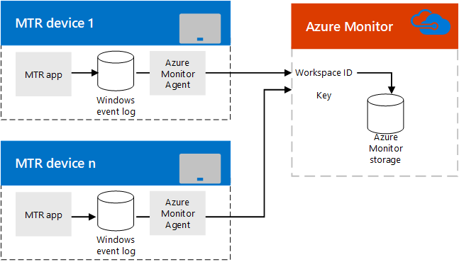

# Planen Microsoft Teams-Räume Überwachung mit Azure Monitor
 
 In diesem Artikel werden Planungsüberlegungen für die Verwendung von Azure Monitor zum Verwalten Microsoft Teams-Räume Geräten in Microsoft Teams oder Skype for Business Implementierung erläutert.

> [!NOTE]
> Sie können auch die [Integritätsüberwachung von Teams-Räume](../alerts/device-health-status.md) mithilfe des Teams Admin Centers einrichten.

[Azure Monitor](/azure/azure-monitor/overview) ist eine Sammlung von Überwachungsdiensten, die von Anfang an in der Cloud entwickelt wurden. Anstatt lokale Ressourcen bereitzustellen und zu verwalten, werden Azure Monitor-Komponenten vollständig in Azure gehostet. Die Konfiguration ist minimal, und Sie können in wenigen Minuten betriebsbereit sein. Mit einigen Anpassungsarbeiten kann es bei der Überwachung Microsoft Teams-Räume helfen, indem es Benachrichtigungen über den Systemstatus oder Fehler für einzelne Raumsysteme bereitstellt, und es kann bis zur Verwaltung von Tausenden von Microsoft Teams-Räume skaliert werden.
  
Dieser Artikel enthält eine Erläuterung der Anforderungen, des Entwurfs/der Architektur und der bewährten Methoden für die Implementierung der Azure Monitor-basierten Überwachung von Microsoft Teams-Räume. Es enthält außerdem Links zu detaillierten Artikeln zur Implementierung von Azure Monitor für Microsoft Teams-Räume und wichtige Referenzinformationen für die fortlaufende Überwachung von Microsoft Teams-Räume Räumen.
  
## Funktionsübersicht

  
Die Microsoft Teams-Räume-App schreibt Ereignisse in das Windows-Ereignisprotokoll. Nach der Installation übergibt ein Microsoft Monitoring-Agent die Informationen an den Azure Monitor-Dienst.
  
Nach der ordnungsgemäßen Konfiguration analysiert Log Analytics die in die Ereignisbeschreibungen eingebettete JSON-Nutzlast, um zu beschreiben, wie Microsoft Teams-Räume funktioniert und welche Fehler erkannt werden.
  
Ein Administrator, der Azure Monitor verwendet, kann Benachrichtigungen über Microsoft Teams-Räume erhalten, die offline sind oder App-, Konnektivitäts- oder Hardwarefehler haben, und wissen, ob ein System neu gestartet werden muss. Jeder Systemstatus wird häufig aktualisiert, sodass diese Benachrichtigungen in der Nähe von Echtzeitupdates sind.
  
## Azure Monitor-Anforderungen

Sie müssen über ein gültiges Azure-Abonnement für Azure Monitor verfügen, um Log Analytics-Features verwenden zu können. Informationen zum Erstellen eines Abonnements für Ihre Organisation finden Sie unter ["Erste Schritte mit einem Log Analytics-Arbeitsbereich](/azure/azure-monitor/learn/quick-create-workspace) ".
  
Sie sollten sich mit der Verwendung des Log Analytics-Ansichts-Designers vertraut machen. Diese Details finden Sie [unter Ansichten in Log Analytics](/azure/azure-monitor/platform/view-designer) .
  
### Verwandte Aufgaben

1. Nachdem Sie Azure Monitor Log Analytics abonniert haben, erstellen Sie benutzerdefinierte Felder (wie unter ["Benutzerdefinierte Felder](azure-monitor-deploy.md#Custom_fields) zuordnen" beschrieben), die zum Analysieren der Informationen erforderlich sind, die von Microsoft Teams-Räume gesendet werden. Dies umfasst das Verständnis des JSON-Schemas, [das in "Grundlegendes zu den Protokolleinträgen](azure-monitor-manage.md#understand-the-log-entries)" dokumentiert ist.
    
2. Entwickeln Sie eine Microsoft Teams-Räume Verwaltungsansicht in Log Analytics. Sie können [ein Microsoft Teams-Räume-Dashboard manuell erstellen](azure-monitor-deploy.md#create-a-microsoft-teams-rooms-dashboard-manually).
    
## Individuelle Microsoft Teams-Räume Anforderungen

Microsoft Teams-Räume ist eine App, die auf einem Computegerät im Kioskmodus ausgeführt wird. Wie bei jeder Windows-App schreibt die Microsoft Teams-Räume-App Ereignisse wie Start- und Hardwarefehler in das Windows-Ereignisprotokoll. Durch das Hinzufügen eines Microsoft Monitor-Agents auf Microsoft Teams-Räume können diese Ereignisse erfasst werden. (Ausführliche Informationen finden Sie [unter Verbinden von Windows-Computern mit dem Log Analytics-Dienst in Azure](/azure/azure-monitor/platform/agent-windows) .)
  
## Laufende Verwaltung

Während Sie Azure Monitor verwenden, um Ihre Microsoft Teams-Räume zu überwachen, müssen Sie die Informationen in den von Azure Monitor verwendeten Ereignisprotokollen verstehen. Ausführliche Informationen zu diesen [Integritätsmeldungen finden Sie unter "Grundlegendes zu den Protokolleinträgen](azure-monitor-manage.md#understand-the-log-entries) ".
  
### Verwandte Aufgaben

- Grundlegendes zu den von Microsoft Teams-Räume generierten Warnungen und deren Behebung (siehe Abschnitt "[Grundlegendes zu den Protokolleinträgen](azure-monitor-manage.md#understand-the-log-entries)")
    
## Siehe auch

[Bereitstellen Microsoft Teams-Räume-Verwaltung mit Azure Monitor](azure-monitor-deploy.md)
  
[Verwalten Microsoft Teams-Räume Geräte mit Azure Monitor](azure-monitor-manage.md)
