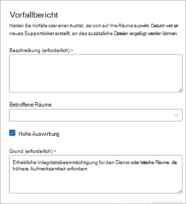

# Vom Kunden gemeldete Vorfalltickets

Für jede Art von Vorfall, den Microsoft nicht gekennzeichnet hat, oder für Fragen zu den Diensten/Features können Kunden oder Partner im Namen von Kunden das Feature "Vorfall melden" verwenden, um Microsoft zu benachrichtigen, um das Problem zu untersuchen oder die Frage zu beantworten.

<!---->

Beschreiben Sie im Feld "Beschreibung" so gut wie möglich das Problem, bei dem Sie Hilfe von Microsoft benötigen. Sie können einen oder mehrere der Räume hinzufügen.

<!---->

Vom Kunden gemeldete Vorfälle (CRIs) gelten als kritische Tickets, was bedeutet, dass das MTRP Service Operations Center diese Tickets zuerst triage.  (Siehe service description SLA for Customer-reported incidents [here](microsoft-teams-rooms-premium.md) When a room or rooms are selected as part of the CRI, each room will be marked as Unhealthy, until the CRI is closed.

## Schließen von Vom Kunden gemeldeten Vorfalltickets

Vom Kunden gemeldete Vorfälle können entweder vom Kunden, Partnern, die Räume im Auftrag von Kunden verwalten, oder von Microsoft Service Operations Center-Technikern geschlossen werden.

**So schließen Sie einen Vorfall**

1. Wählen Sie **"Schließen**" aus.
1. Wählen Sie einen Grund für das Schließen aus, indem Sie eine Kategorie aus der Liste auswählen.

   Nachdem Sie den Grund für das Schließen bestätigt haben, wird das Ticket geschlossen und nach **Resolved** verschoben.

<!---->

<!---->

Im Abschnitt "Ticketdetails – Übersicht" können Kunden oder Partner, die Räume im Namen von Kunden verwalten, sehen, wer das Ticket geschlossen hat: entweder der Dienst für verwaltete Räume (Microsoft) oder der Name des Kunden/Partners.  

<!---->

## Häufig gestellte Fragen

**Kann jemand Tickets schließen?**

Nur vom Kunden gemeldete Vorfälle können durch einen Benutzer oder das Microsoft Managed Rooms Service Operations Center geschlossen werden. Kunden, die einem Partner zugewiesen haben, ihre Räume mit Ticketverwaltungsberechtigungen zu verwalten, haben die Möglichkeit, vom Kunden gemeldete Vorfälle zu schließen.

**Kann ich einschränken, wer Tickets schließen kann?**

Zurzeit nicht. Alle Benutzer, die über Ticketverwaltungsberechtigungen verfügen, können einen CRI schließen.

**Erhalte ich eine Benachrichtigung, wenn ein vom Kunden gemeldetes Vorfallticket geschlossen wird?**

Zurzeit nicht.