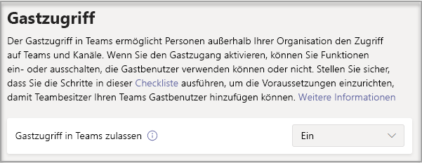
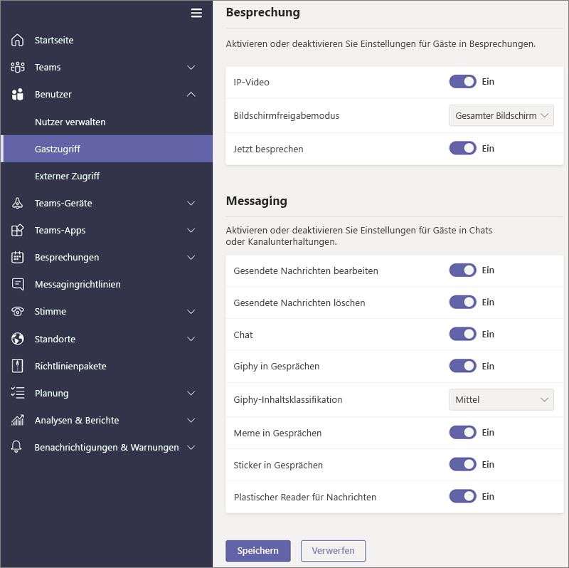

# Aktivieren oder Deaktivieren des Gastzugriffs in Microsoft Teams

In diesem Artikel wird beschrieben, wie Sie Einstellungen für den Gastzugriff – einschließlich Anrufe, Besprechungen und Chats – in Teams konfigurieren. Der Gastzugriff in Teams erfordert auch das Konfigurieren anderer Einstellungen in Microsoft 365, einschließlich Einstellungen in Azure AD, Microsoft 365-Gruppen und SharePoint. Wenn Sie mit der Einladung von Gästen zu Microsoft Teams beginnen möchten, lesen Sie einen der folgenden Beiträge:

- Informationen zum Konfigurieren des Gastzugriffs für Microsoft Teams für die allgemeine Nutzung finden Sie unter [Zusammenarbeit mit Gästen in einem Team](/microsoft-365/solutions/collaborate-as-team).
- Wenn Sie mit einer Partnerorganisation zusammenarbeiten möchten, die Azure Active Directory verwendet, und es Gästen gestatten möchten, sich selbst für den Zugang zu Teams zu registrieren, lesen Sie [Erstellen eines B2B-Extranets mit verwalteten Gästen](/microsoft-365/solutions/b2b-extranet).

> [!NOTE]
> Wenn Sie nur Personen in anderen Organisationen suchen, anrufen, mit ihnen chatten und Besprechungen mit ihnen einrichten möchten, verwenden Sie den [externen Zugriff](manage-external-access.md).

## Konfigurieren des Gastzugriffs im Admin Center für Teams

1. Melden Sie sich beim [Admin Center für Microsoft Teams](https://admin.teams.microsoft.com/) an.

2. Wählen Sie **Benutzer** > **Gastzugriff** aus.

3. Legen Sie **Gastzugriff in Teams zulassen** auf **Ein** fest.

    

4. Wählen Sie je nachdem, was Sie für Gäste zulassen möchten, unter **Anrufen**, **Besprechung** und **Nachrichten** entweder **Ein** oder **Aus** aus.

      - **Private Anrufe führen**: **Aktivieren** Sie diese Einstellung, um Gästen Peer-to-Peer-Anrufe zu ermöglichen.
      - **IP-Video**: **Aktivieren** Sie diese Einstellung, damit Gäste Video in ihren Anrufen und Besprechungen verwenden dürfen.
      - **Bildschirmfreigabemodus**: Diese Einstellung steuert die Verfügbarkeit der Bildschirmfreigabefunktion für Gäste.
          - Legen Sie diese Einstellung auf **Deaktiviert** fest, wenn Sie möchten, dass Gäste ihren Bildschirm in Teams nicht übertragen können.
          - Legen Sie diese Einstellung auf **Einzelne Anwendung** fest, um die Übertragung einzelner Anwendungen zu gestatten.
          - Legen Sie diese Einstellung auf **Vollbild** fest, um die vollständige Bildschirmübertragung zuzulassen.
      - **Jetzt besprechen**: **Aktivieren** Sie diese Einstellung, um Gästen die Verwendung des Features „Jetzt besprechen“ in Microsoft Teams zu ermöglichen.
      - **Gesendete Nachrichten bearbeiten**: **Aktivieren** Sie diese Einstellung, um Gästen die Bearbeitung von zuvor gesendeten Nachrichten zu ermöglichen.
      - **Gesendete Nachrichten löschen**: **Aktivieren** Sie diese Einstellung, um Gästen das Löschen von zuvor gesendeten Nachrichten zu ermöglichen.
      - **Chat**: **Aktivieren** Sie diese Einstellung, um Gästen den Zugriff auf den Chat in Teams zu ermöglichen.
      - **Giphys in Unterhaltungen**: **Aktivieren** Sie diese Einstellung, um Gästen die Verwendung von Giphys in Unterhaltungen zu ermöglichen. Giphy ist eine Onlinedatenbank und Suchmaschine, die es Benutzern ermöglicht, nach animierten GIF-Dateien zu suchen und diese zu teilen. Jedem Giphy wird eine Inhaltsbewertung zugewiesen.
      - **Giphy-Inhaltsbewertung**: Wählen Sie eine Bewertung aus der Dropdown-Liste aus:
          - **Alle Inhalte zulassen**: Gäste können alle Giphys in Chats einfügen, unabhängig von der Inhaltsbewertung.
          - **Moderat**: Gäste können Giphys in Chats einfügen, der Zugriff auf nicht jugendfreie Inhalte wird aber moderat eingeschränkt.
          - **Streng**: Gäste können Giphys in Chats einfügen, der Zugriff auf nicht jugendfreie Inhalte wird aber eingeschränkt.
      - **Memes in Unterhaltungen**: **Aktivieren** Sie diese Einstellung, um Gästen die Verwendung von Memes in Unterhaltungen zu ermöglichen.
      - **Sticker in Unterhaltungen**: **Aktivieren** Sie diese Einstellung, um Gästen die Verwendung von Stickern in Unterhaltungen zu ermöglichen.
      - **Plastischer Reader für Nachrichten**: **Aktivieren** Sie diese Einstellung, um Gästen die Verwendung des [plastischen Readers in Teams](https://support.microsoft.com/topic/a700c0d0-bc53-4696-a94d-4fbc86ac7a9a) zu ermöglichen.

    

5. Klicken Sie auf **Speichern**.

## Gastzugriff deaktivieren

Wenn Sie den Gastzugriff in Microsoft Teams deaktivieren, verlieren vorhandene Gäste den Zugriff auf ihr Team. Sie werden jedoch nicht aus dem Team entfernt. Sie sind weiterhin für Personen im Team sichtbar und können @erwähnt werden. Wenn Sie den Microsoft Teams-Gastzugriff wieder aktivieren, erhalten die Gäste den Zugriff wieder.

Wenn Sie den Gastzugriff deaktivieren möchten, sollten Sie Ihren Teambesitzern empfehlen, die Gastkonten manuell aus ihren Teams zu entfernen. Diese Gäste haben zwar keinen Zugriff, aber wenn ihre Konten weiterhin im Team angezeigt werden, kann dies zu Verwirrung bei anderen Personen im Team führen.

## Siehe auch

[Sichere Zusammenarbeit mit Microsoft 365 einrichten](/microsoft-365/solutions/setup-secure-collaboration-with-teams)

[Blockieren von Gästen aus einem bestimmten Team](/microsoft-365/solutions/per-group-guest-access)

[Set-CsTeamsClientConfiguration](/powershell/module/skype/set-csteamsclientconfiguration)
