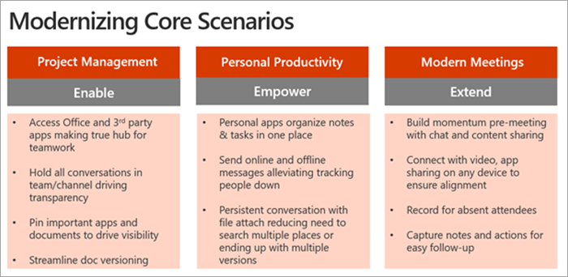

# Definieren von Verwendungsszenarios für Microsoft Teams

Stellen Sie sicher, dass Sie die Geschäftsprojekte (Szenarien) kennen, die im Rahmen dieser Phase Ihrer Implementierung stehen werden. Sehen Sie sich diese Liste der Beispielszenarien an, die sich hervorragend für ein Early Adopter-Programm eignen. Sie können mit einfachen Gewinnen beginnen, z. B.:

- Persönliche Produktivität
- Modernes Projektmanagement
- Moderne Besprechungen

Weitere zu berücksichtigenden Szenarien sind:

- Mitarbeiterbindung und Kommunikation
- Schnellere Markteinführung von Kampagnen
- Steigern der Vertriebsproduktivität und Steigern des Umsatzes
- Optimieren von Geschäftsbewertungen

Stellen Sie sich die Modernisierungsbewegung dieses Szenarios als einen kumulativen Prozess vor – bringen Sie die Dinge mit grundlegenderen Szenarien in Gang, um Begeisterung, Vertrautheit und Glaubwürdigkeit mit dieser neuen Arbeitsweise zu schaffen. Fahren Sie dann mit ehrgeizigeren Wirkungsbereichen fort. Wenn Ihren Geschäftskollegen mehr Auswirkungen auf Microsoft Teams gezeigt werden, werden mehr von ihnen engagiert und Dynamik entsteht. Sobald viele unserer Kunden diesen Prozess in Gang bringen, stellen sie fest, dass sich die Geschäftsbeteiligten ihnen nähern, nachdem sie erfahren haben, wie ihre Kollegen von Microsoft Teams profitieren.

## Interviewen von Geschäftsbeteiligten

Um die Auswahl dieser frühen Projekte zu bestätigen, empfehlen wir, sich direkt mit den Projektbeteiligten zu treffen, die Sie zuvor in diesem Prozess identifiziert haben. Ihr Ziel an dieser Stelle ist es, zuzuhören und zusätzliche Informationen über ihr Unternehmen zu erfahren. Berücksichtigen Sie die folgenden Fragen, um die Unterhaltung voranzutreiben:

- Was sind einige der Herausforderungen oder Schwachstellen der Organisation im Zusammenhang mit Kommunikation und Zusammenarbeit?
- Welche Bereiche möchte Ihre Organisation verbessern?
- Welche strategischen Initiativen oder aktuellen Transformationsprojekte kann Teams unterstützen?
- Welche Kommunikationsmethoden und Zusammenarbeitsmethoden werden in Ihrer Organisation in der Regel besser aufgenommen als andere?
- Wie sieht der Prozess zum Entwerfen, Verteilen und Teilen von Informationen aus?

## Zuordnen und Priorisieren von Geschäftsszenarien

Um sicherzustellen, dass Sie über die richtigen Informationen zum Geschäftsszenario verfügen, sollten Sie das folgende Format verwenden, um das Szenario aus der Perspektive des Mitarbeiters zu dokumentieren, der die Arbeit abgeschlossen hat, und des Geschäftsinhabers des Prozesses. Beide Perspektiven sind erforderlich, um einen erfolgreichen Weg nach vorne zu machen.

Nachdem Sie mit einem oder mehreren Geschäftsbeteiligten gesprochen haben, können Sie Ihre Szenarien basierend auf Auswirkungen und Schwierigkeiten priorisieren. (Ihre Szenarien können zusätzlich zu den oben vorgeschlagenen Szenarien sein.) Geeignete Kandidaten für Ihre Experimentphase sollten höhere Auswirkungen und niedrige bis mittlere Schwierigkeiten haben. Auf diese Weise wird sichergestellt, dass Ihr Projekt nicht von Bereichsschleichen oder technischen Schwierigkeiten betroffen ist, bevor Sie den Wert Ihrer Arbeit anzeigen können. Unten ist ein Beispieldiagramm dargestellt.

> [!Note]
> Wir sind immer bestrebt, zu erfahren, wie unsere Kunden Teams auf neue innovative Weise verwenden. Teilen Sie Ihre #TeamsStories mit uns in unserem [Diskussionsforum "Einführung fördern"](https://techcommunity.microsoft.com/t5/driving-adoption/ct-p/DrivingAdoption). Fügen Sie das Hashtag **#TeamsStories** in Ihren Beitrag ein. Wir sind immer daran interessiert, wie Sie Teams in Ihrer Organisation verwenden.

 Als Nächstes: [Onboarding von Early Adopters und Sammeln von Feedback](teams-adoption-onboard-early-adopters.md).
