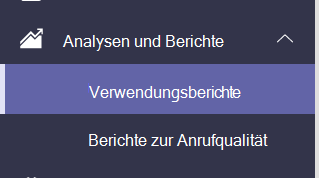

# Microsoft Teams App-Nutzungsbericht

Der Bericht Teams App-Nutzung im Microsoft Teams Admin Center enthält Informationen dazu, welche Apps Benutzer in Teams verwenden.  

## Anzeigen des App-Nutzungsberichts

1. Klicken Sie im linken Navigationsbereich des Admin Centers unter <https://admin.teams.microsoft.com>auf **"Analytics &** **reportsUsage** >  reports".  
2. Wählen Sie auf der Registerkarte " **Berichte anzeigen** " unter **"Bericht"** die Option **"App-Nutzung"** aus.

3. Wähl Sie unter **Datumsbereich** einen Bereich aus, und klicken Sie dann auf **Bericht ausführen**. Der Bericht Teams Apps-Nutzung kann nach Trends in den letzten 7, 30 oder 90 Tagen angezeigt werden.  

## Interpretieren des Berichts

:::image type="content" alt-text="Screenshot des Teams App-Nutzungsberichts im Teams Admin Center mit Beschriftungen." source="media/app-usage-report5.png" lightbox="media/app-usage-report5.png":::

Jeder Bericht hat ein Datum oben links, das anzeigt, wann der Bericht erstellt wurde. Berichte spiegeln in der Regel eine Wartezeit von 24 Stunden ab dem Zeitpunkt des Öffnens einer App wider.

Die Y-Achse im Diagramm ist die Anzahl der Benutzer, die für das Datum, das Sie durch Bewegen des Mauszeigers auf das Diagramm ausgewählt haben, als aktive Benutzer gelten, da sie mindestens einmal eine App geöffnet haben.

Die X-Achse im Diagramm ist der Datumsbereich, den Sie für den Bericht ausgewählt haben.

Zeigen Sie mit der Maus auf den Punkt (4), der die Nutzung einer App an einem beliebigen Datum darstellt, um die Gesamtzahl der aktiven Benutzer dieser App an diesem Datum anzuzeigen.

Wenn Sie andere Apps auswählen möchten, klicken Sie oben rechts auf das **Filtersymbol** (5), wählen Sie neue Kriterien aus, oder geben Sie neue Kriterien ein, und klicken Sie dann auf **Übernehmen**.

In der Tabelle unten im Bericht (6) werden aktive Benutzer und Teams nach App-Namen angezeigt.

   - **Der App-Name** ist der Anzeigename der in Teams verwendeten App.
   - **Aktive Benutzer** ist die Anzahl der Benutzer, die die App mindestens einmal während des angegebenen Zeitraums geöffnet haben.
   - **Der App-Typ** ist ein statischer Wert von "Microsoft" oder "Third Party".
   - **Aktive Teams** ist die Anzahl der Teams, die die App von mindestens einem Mitglied des Teams und während der angegebenen Zeiträume geöffnet haben.
   - **Publisher** ist der Softwareherausgeber der App.
   - **Version** ist die Softwareversion der App vom App-Herausgeber.

   > [!NOTE]
   > **Aktive Benutzer** und **aktive Teams** werden nur für Apps berechnet, die in Kanälen verwendet werden.

Zum Hinzufügen oder Entfernen von Spalten in der Tabelle klicken Sie oben rechts auf das Symbol " **Spalten bearbeiten** " (7), wählen Sie auf der Registerkarte " **Spalten bearbeiten** " neue Kriterien aus, und klicken Sie dann auf **"Übernehmen**".

Um den Bericht zur Offlineanalyse in eine CSV-Datei zu exportieren, wählen Sie oben rechts das Symbol "**In Excel exportieren**" (8) aus, und klicken Sie dann auf der Registerkarte **"Downloads**" unter **"Status**" auf **"Herunterladen**".

   :::image type="content" alt-text="Screenshot des Bereichs &quot;Downloads&quot;." source="media/app-usage-report7.png" lightbox="media/app-usage-report7.png":::

Wenn Sie den Bericht in Excel anzeigen, wird auch eine **Id-Spalte** angezeigt, die die App-ID darstellt, in der Regel eine alphanumerische Zeichenfolge. Wenn die **ID** **\n** ist, bedeutet dies, dass ein Benutzer die Löschung seiner Informationen angefordert hat.

   

## Verwandte Themen

- [Teams – Analyse und Berichterstellung](teams-reporting-reference.md)
